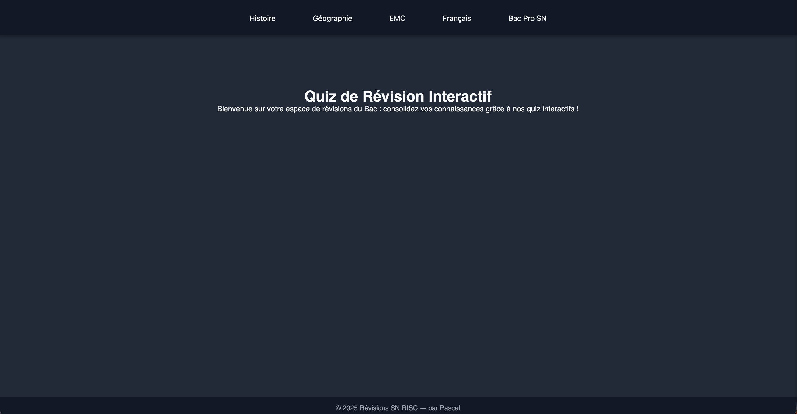

# Quiz de Révision Interactif Bac Pro SN

Un projet web “vanilla” (HTML/CSS/JS) pensé pour faciliter les révisions du Bac Pro Systèmes Numériques (SN) et d’autres matières (Histoire, Géographie, EMC, Français).  
Des quiz dynamiques, responsive et animés pour tester vos connaissances et cibler vos lacunes.

> **En ligne :** https://rev-bac.vercel.app/

---

## 📚 Fonctionnalités principales

- **15 questions par thème**  
- **Feedback immédiat** : correction automatique, score et conseils de révision  
- **Interface Desktop & Mobile** : barre de navigation déroulante et menu “drawer” optimisé  
- **Animations CSS** : sous-menus qui glissent, retours visuels et transitions fluides  
- **Thèmes couverts** :  
  - **Histoire** : Guerre froide, Décolonisation  
  - **Géographie** : Ressources & Développement Durable, Sociétés & Risques  
  - **EMC** : Défis de Société & Bioéthique  
  - **Français** : Œuvres étudiées, Figures de style  
  - **Bac Pro SN** : Architecture & OS, Réseaux & IP, Systèmes Embarqués, Cybersécurité

---

## 🚀 Mise en route

1. **Cloner ou télécharger** le dépôt.  
2. **Ouvrir** `index.html` dans votre navigateur ou lancer un serveur local  
   (ex. VSCode Live Server ou `python -m http.server`).  
3. **Sélection du quiz**  
   - **Desktop** : cliquez sur un thème dans la barre du haut pour dérouler son sous-menu.  
   - **Mobile** : appuyez sur ☰ pour ouvrir le menu latéral, déroulez les catégories et sélectionnez un quiz.

---

## 🛠️ Architecture du code

- **`index.html`** : structure globale, navbar desktop, drawer mobile, containers de quiz, footer  
- **CSS** (dans `<head>`) : variables, layout responsive, animations sub-nav et drawer  
- **JavaScript** (fin de `<body>`) :  
  - Données JSON des questions (`quizData`)  
  - Génération dynamique des quiz  
  - Navigation desktop & mobile  
  - Soumission des réponses & feedback  

---

## 📦 Technologies utilisées

- **HTML5**  
- **CSS3** (Flexbox, variables, transitions)  
- **JavaScript (ES6+)**  

*Pas de frameworks externes : tout est “vanilla” pour la légèreté et la simplicité.*  

---

## ⚖️ Licence

Distribué sous **Licence MIT**. Vous êtes libre de l’utiliser et de l’adapter, à condition de conserver la mention d’auteur.

